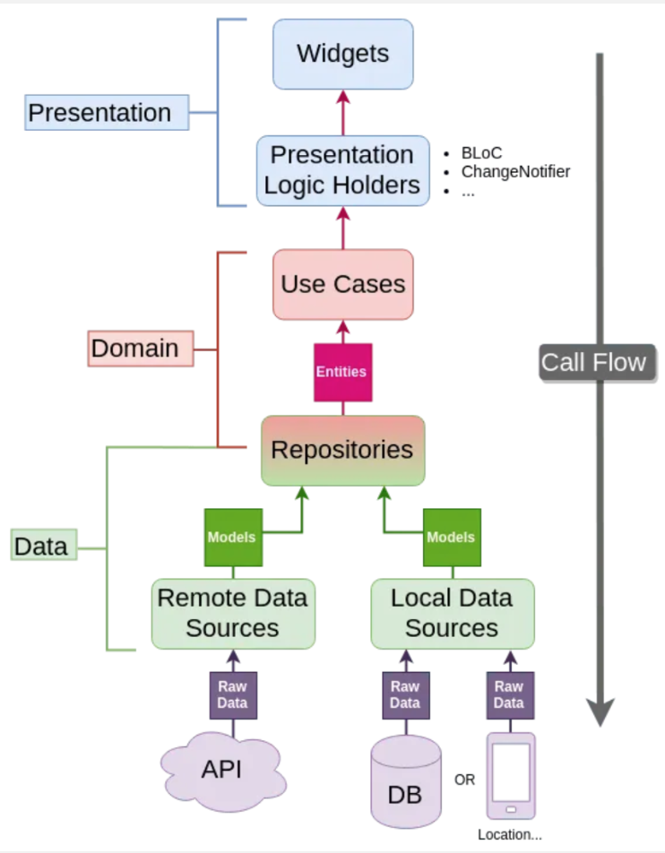
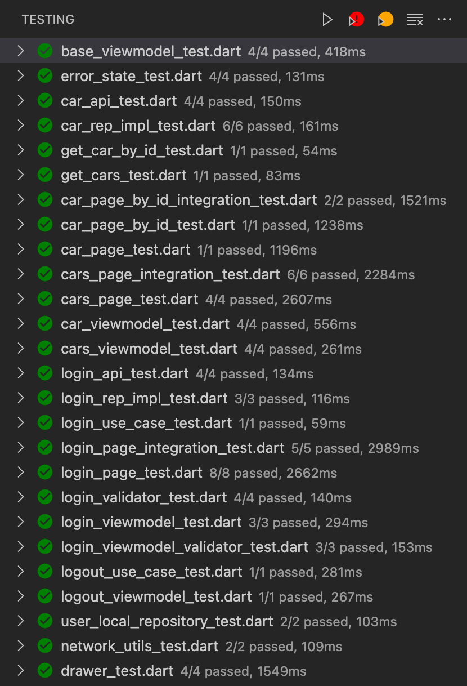
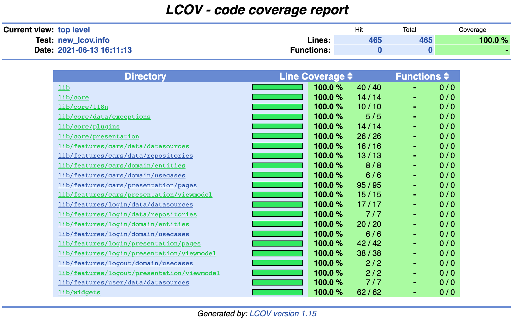

# Carros

Flutter - App Exemplo com Clean Architecture

Possui apenas 3 telas para facilitar o entendimento.

## Arquitetura
Baseado na proposta do Reso Coder: 
(https://resocoder.com/2019/08/27/flutter-tdd-clean-architecture-course-1-explanation-project-structure/)

 

## Testes (Unit / Widget)

O app possui testes em todas as camadas:
* Testes de Widget
* Presenter (ViewModel)
* UseCase / Domain
* Repository
* DataSource / API

### Run Tests

flutter test --coverage

### Test Code Coverage

## Testes de Integração

Além dos testes unitários e de Widgets, foi criado um teste de integração para demonstrar um fluxo completo de login com sucesso no aplicativo.

### Run Integration Tests
flutter drive \
  --driver=integration_test/driver.dart \
  --target=integration_test/app_test.dart